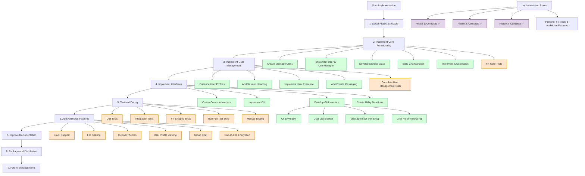
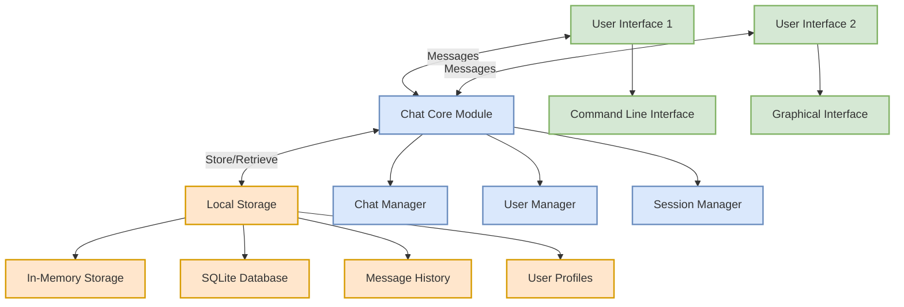

# PyChat Implementation Flow Diagram

The following diagram visualizes the implementation process for the PyChat application as outlined in the SUMMARY.md file.

## Running the Application

As outlined in the SUMMARY.md:

- CLI Interface: `python -m pychat.interfaces.cli_interface`
- GUI Interface: `python -m pychat.interfaces.gui_interface` or `python run_gui.py`
- Tests: `./run_tests.sh` or `python -m pytest`

## Component Interaction Diagram

The following diagram shows how the main components of the PyChat application interact:

This visualization represents the implementation steps for the PyChat application based on the SUMMARY.md file, showing both the implementation process flow and the component interactions within the application architecture.
