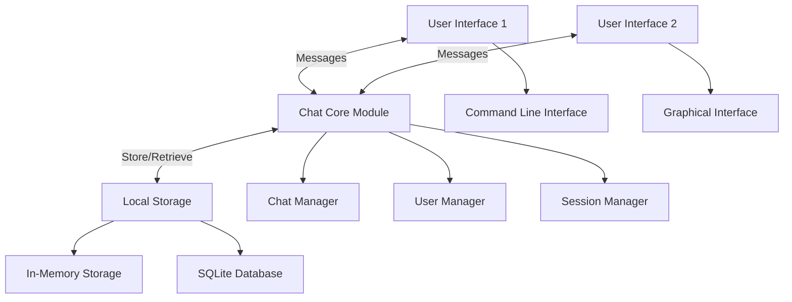
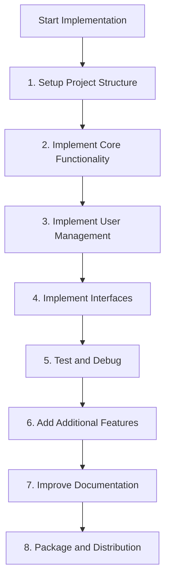

# PyChat Project Presentation

## Slide 1: Project Overview

# PyChat: Python Chat Application

- Simple, lightweight chat application built with Python 3
- Multiple interfaces (CLI and GUI)
- Single-machine architecture with local storage
- Real-time messaging with message history

_June 18, 2025_

---

## Slide 2: Features

# Key Features

- ✅ Real-time messaging
- ✅ User authentication
- ✅ Multiple concurrent connections
- ✅ Private messaging
- ✅ Chat history
- ✅ GUI and CLI interfaces
- ⏳ Emoji support (partially implemented)
- ⏳ File sharing (planned)
- ⏳ End-to-end encryption (future)

---

## Slide 3: Architecture

# Application Architecture



---

## Slide 4: Implementation Phases

# Implementation Approach: Three Phases

1. **Core Functionality** ✅

   - Message handling, user management, storage
   - Basic command-line interface

2. **User Management** ✅

   - Enhanced user profiles
   - Session handling and authentication
   - Private messaging

3. **GUI and Enhancements** ✅
   - Graphical interface with Tkinter
   - Chat history browsing
   - Enhanced user experience

---

## Slide 5: Phase 1 Details

# Phase 1: Core Functionality

- ✅ Message class for handling and serializing messages
- ✅ User class and UserManager for user management
- ✅ Storage with in-memory and SQLite backends
- ✅ ChatManager for message handling between users
- ✅ ChatSession for active user session management
- 🔄 Tests (some still failing)

_This phase established the foundation of the application_

---

## Slide 6: Phase 2 Details

# Phase 2: User Management

- ✅ Enhanced user profiles with additional attributes
- ✅ Session handling for authentication
- ✅ User presence management (online/offline status)
- ✅ Private messaging between users
- 🔄 Test completion

_This phase added the user management layer_

---

## Slide 7: Phase 3 Details

# Phase 3: GUI and Interfaces

- ✅ Common interface base class
- ✅ Command-line interface with command parsing
- ✅ GUI interface built with Tkinter
  - Chat window with message display
  - User list sidebar
  - Message input with emoji support
  - Chat history browsing
- ✅ Utility functions for formatting and display

_This phase completed the user-facing interfaces_

---

## Slide 8: Project Progress

# Implementation Progress



**Current Status**: Between steps 5 (Test and Debug) and 6 (Additional Features)

---

## Slide 9: Testing Status

# Testing Status

- Unit tests implemented for all main components
- Integration tests verify cross-component functionality
- Some tests currently skipped with `@skip_failing` decorator
- Test categories:
  - Basic functionality tests
  - Chat Manager tests
  - Storage tests
  - Interface tests
  - Integration tests
  - Error handling tests

_Next steps: Fix failing tests and improve test coverage_

---

## Slide 10: Next Steps

# Next Steps

1. **Fix Failing Tests**

   - Address tests currently marked with `@skip_failing`

2. **Add Enhanced Features**

   - Complete emoji support
   - Implement file sharing
   - Add custom themes
   - Implement user profile viewing

3. **Improve Documentation**
   - Complete code documentation
   - Create comprehensive user guide

---

## Slide 11: Future Roadmap

# Future Roadmap

- **End-to-end encryption** for secure messaging
- **Group chat** functionality
- **Voice/video chat** capabilities
- **Cross-platform support** (mobile, web)
- **Chatbot integration**
- **Rich text formatting**
- **Desktop notifications** for new messages

---

## Slide 12: Running the Application

# Running PyChat

**CLI Interface**:

```bash
python -m pychat.interfaces.cli_interface
```

**GUI Interface**:

```bash
python -m pychat.interfaces.gui_interface
# or
python run_gui.py
```

**Running Tests**:

```bash
./run_tests.sh
# or
python -m pytest
```

---

## Slide 13: Demo & Questions

# Demo & Questions


Thank you for your attention!

_Questions?_
